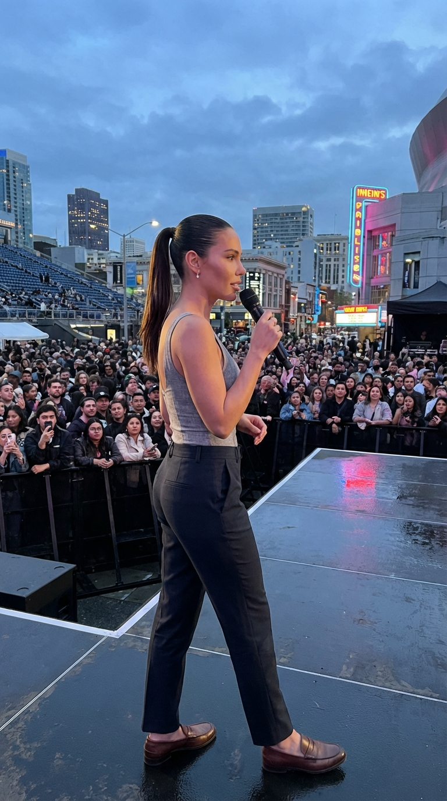
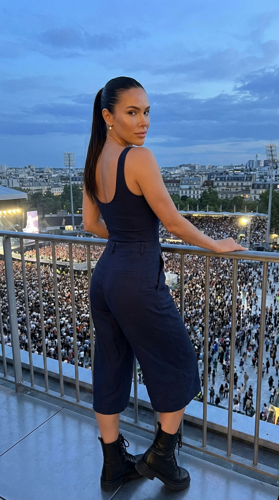
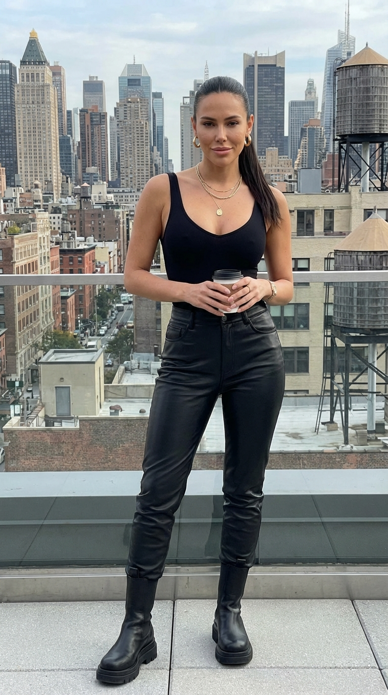
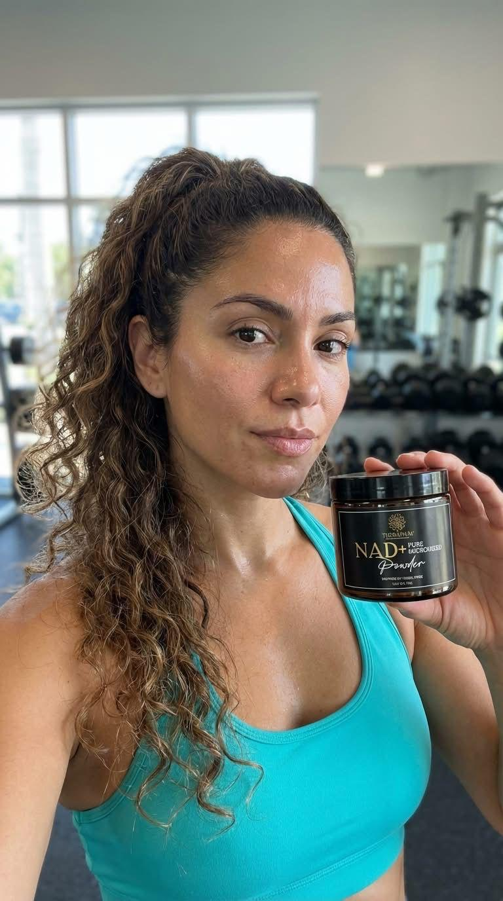

# 💰 Money Printer Pro

**The most powerful open-source AI content generator.** Create photorealistic images and cinematic videos of any persona using Google Gemini + VEO 3.1 — fully autonomous content pipeline.


---

## 📸 Generated Examples — Zero Manual Editing

> Every image and video below was generated **100% by Money Printer Pro**. Same persona, consistent identity across all outputs.

### AI-Generated Images

<p align="center">
  
  
  
</p>
<p align="center">
  
  
  
</p>
<p align="center">
  
  
</p>

> 👆 8 images, 1 persona, different styles — **the face stays consistent** because of our identity lock engine.

### 🎬 AI-Generated Videos (VEO 3.1)

<table align="center">
  <tr>
    <td align="center">
      <a href="examples/demo-veo.mp4">
        
      </a>
      <br/><sub>Image → 8s video · VEO 3.1</sub>
    </td>
    <td align="center">
      <a href="examples/demo-1.mp4">
        
      </a>
      <br/><sub>Urban lifestyle</sub>
    </td>
    <td align="center">
      <a href="examples/demo-2.mp4">
        
      </a>
      <br/><sub>Fashion editorial</sub>
    </td>
  </tr>
</table>

### 🎞️ Multi-Shot Video Sequences

The pipeline can generate **multi-shot sequences** — multiple cinematic clips from different angles, seamlessly chained:

<table align="center">
  <tr>
    <td align="center">
      <a href="examples/sequence-hook.mp4">
        
      </a>
      <br/><sub>Close-up hook shot</sub>
    </td>
    <td align="center">
      <a href="examples/sequence-portrait.mp4">
        
      </a>
      <br/><sub>Mid-range portrait</sub>
    </td>
    <td align="center">
      <a href="examples/sequence-movement.mp4">
        
      </a>
      <br/><sub>Movement tracking</sub>
    </td>
  </tr>
</table>

> ⭐ **If this is useful to you, give it a star!** It helps others discover it.

---

## 🔥 What Makes This Different

Most AI image generators give you a prompt box and a button. Money Printer Pro is a **full autonomous content pipeline** — the same system used to run AI-powered social media accounts.

| Feature | Other Tools | Money Printer Pro |
|---------|:-----------:|:-----------------:|
| Image generation | ✅ | ✅ |
| Video generation (VEO 3.1) | ❌ | ✅ |
| Multi-shot video sequences | ❌ | ✅ |
| Identity preservation (same face) | ❌ | ✅ |
| 7 visual engines (lighting, shadow, motion...) | ❌ | ✅ |
| AI quality scoring (5 channels) | ❌ | ✅ |
| Smart content planner (anti-repeat) | ❌ | ✅ |
| Autopilot mode (batch generation) | ❌ | ✅ |
| Publish guard (quality gate) | ❌ | ✅ |
| Your own API key (no middleman) | ❌ | ✅ |

---

## ✨ Features

### 🖼️ AI Image Generation
Photorealistic images with identity-locked reference photos. Upload one photo → get consistent identity across hundreds of generations.

### 🎬 AI Video Generation
8-second cinematic 9:16 videos from any generated image using **Google VEO 3.1**. Perfect for Reels, TikTok, Shorts.

### 🧠 7 Visual Engines
Ported from a production autonomous agent pipeline:
- **Lighting Engine** — golden hour, studio, neon, based on location & time
- **Shadow Engine** — directional shadows matching the lighting
- **Motion Engine** — motion profiles (subtle, dynamic, static)
- **Weather Engine** — weather validation & visual effects
- **Outfit Bias Engine** — outfit adjustments for scene/weather
- **Scene Validator** — validates shot/scene combinations
- **Visual Context Orchestrator** — combines all engines into one cinematic prompt

### 📋 Smart Content Planner
- **Weighted pillar selection** — balances content types (lifestyle, urban, music...)
- **Anti-repeat scene picker** — never generates the same location/outfit/time twice in a row
- **Shot picker** — weighted archetype selection with constraints
- **Caption generator** — pillar-aware captions with soft CTAs

### 📊 AI Quality Scoring
Python FastAPI microservice that analyzes generated videos across 5 channels:
- Face stability · Eye engagement · Lighting consistency · Motion smoothness · Composition

### 🛡️ Publish Guard
Quality gate with persona-specific thresholds — blocks low-quality content from publishing.

### 🚀 Autopilot Mode
Batch generate content automatically. Pick a persona, set the count, hit go. Planner decides style, location, shot — you just collect the results.

---

## 🚀 Quick Start

### 1. Clone & Install

```bash
git clone https://github.com/office233/MoneyPrinterPro.git
cd MoneyPrinterPro
npm install
```

### 2. Get a Gemini API Key

1. Go to [Google AI Studio](https://aistudio.google.com/apikey)
2. Click **"Create API Key"**
3. Copy the key

### 3. Run

```bash
npm run dev
```

### 4. Configure

1. Open `http://localhost:3000`
2. Go to **⚙️ Settings** → paste your Gemini API key → **Test Connection**
3. Create a persona → upload a reference photo
4. Generate images or videos 🎉

### 5. (Optional) Start Scoring Service

```bash
cd scoring-service
pip install -r requirements.txt
uvicorn main:app --port 8000
```

---

## 💰 Pricing (Pay Google Directly)

You pay Google directly. No middleman. No markup. No subscription.

| What | Model | Cost |
|------|-------|------|
| Image (512px) | Gemini Flash Image | ~$0.045 |
| Image (1024px) | Gemini Flash Image | ~$0.067 |
| Video (8s 9:16) | VEO 3.1 | ~$0.50 |

**$10 ≈ 150 images or 20 videos.** Your data stays on your machine.

---

## 📁 Project Structure

```
money-printer-pro/
├── src/app/                  # Next.js pages
│   ├── page.jsx              # Dashboard (job history + stats)
│   ├── generate/             # Generation page (image/video/both)
│   ├── autopilot/            # Autopilot batch generation
│   ├── settings/             # API key settings
│   ├── personas/new/         # Create persona
│   └── api/                  # Backend routes
│       ├── generate/         # Image generation
│       ├── generate-video/   # Video generation (VEO)
│       ├── jobs/             # Job history
│       ├── autopilot/        # Autopilot controller
│       └── score/            # Quality scoring
├── src/lib/
│   ├── engines/              # 7 visual engines
│   ├── planner/              # Content planner
│   ├── video/                # VEO video module
│   ├── scoring/              # Scoring client
│   ├── db.js                 # SQLite database
│   └── publish-guard.js      # Quality gate
├── src/config/               # Engine config JSONs
├── scoring-service/          # Python FastAPI scoring
├── examples/                 # Generated examples (in repo)
├── assets/                   # Reference & generated (gitignored)
└── data/                     # SQLite database (gitignored)
```

---

## 🛠️ Tech Stack

| Layer | Technology |
|-------|-----------|
| **Frontend** | Next.js 16, React 19 |
| **AI — Images** | Google Gemini API (`@google/genai`) |
| **AI — Video** | Google VEO 3.1 (Vertex AI) |
| **Engines** | 7 visual context engines (pure JS) |
| **Database** | SQLite via better-sqlite3 |
| **Scoring** | Python FastAPI + OpenCV + InsightFace |
| **Styling** | Vanilla CSS (dark Linear-inspired theme) |

---

## 🔒 Privacy & Security

- **API keys live only in your browser's `localStorage`.** Sent via `x-api-key` header only.
- **No server-side fallback key.** No key = HTTP 401.
- **All inputs validated server-side** — path traversal protection, MIME checking, body size limits.
- **No telemetry, no tracking, no analytics.**
- **Everything stays on your machine.**

---

## 📝 License

MIT — Use it however you want. Make money with it. 💰

---

**⭐ Star this repo if you're making money with AI-generated content!**

**Made with ❤️ and AI**
